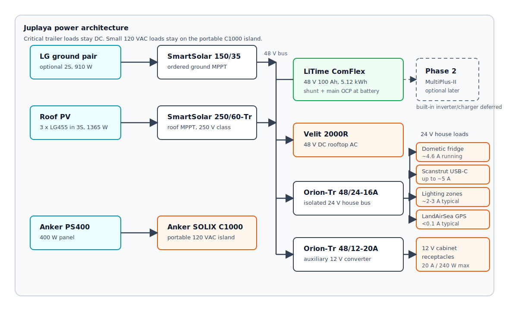
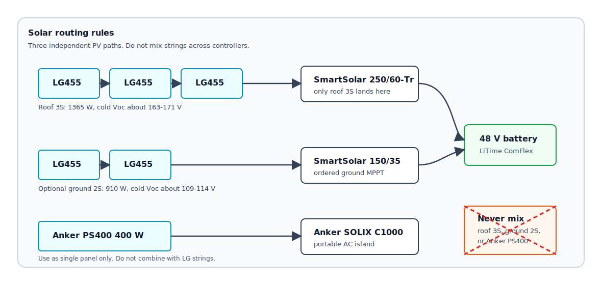

# Power / Electrical

This is the detailed power source of truth for the Juplaya trailer build. The build sheet keeps only the abbreviated view; this document carries the wiring architecture, solar topology, component decisions, commissioning rules, and energy budget.

Related decisions: [D002](DECISION_LOG.md), [D006](DECISION_LOG.md), [D008](DECISION_LOG.md). Key receipts: [3-panel house-power verdict](../runs/aio-adversarial-3panel/synth/VERDICT.md), [SmartSolar 250/60 specs](reference/victron-smartsolar-mppt-250-60-tr-specs.md), [SmartSolar 150/35 specs](reference/victron-smartsolar-mppt-150-35-specs.md), [C1000/PS400 specs](reference/anker-solix-c1000-ps400-specs.md), [ComFlex battery specs](reference/litime-48v-100ah-battery-specs.md).

## Diagrams





## Current Verdict

For Juplaya, the built-in inverter/charger is deferred. Critical trailer loads stay on DC:

- Roof solar charges the 48 V trailer battery through a Victron SmartSolar 250/60-Tr.
- The Velit 2000R runs directly from the 48 V battery on its own fused branch.
- One Victron Orion-Tr 48/24-16A feeds the 24 V house bus for fridge, lights, USB, GPS, and winter heater rough-in.
- Small 120 VAC loads run from the standalone Anker SOLIX C1000 + PS400 panel.
- The Victron MultiPlus-II 48/3000/35-50 120V remains the Phase 2 built-in inverter/charger choice, not a Juplaya blocker.

## Architecture

One high-voltage battery bus, one conversion step down, no permanent 12 V rail:

```text
Roof PV (3 x LG455 in 3S)
        |
   Victron SmartSolar MPPT 250/60-Tr
        |
   LiTime 48V 100Ah ComFlex (5.12 kWh)
        | 500A shunt, main OCP
        +-- 48 V branch: Velit 2000R rooftop AC, own fused branch
        +-- Victron Orion-Tr 48/24-16A isolated -> Blue Sea 5026 24 V block
                                                        +-- fridge, 24 V native
                                                        +-- LED zones, USB-C PD, GPS
                                                        +-- winter heater outlet

Optional deployable LG ground PV (2S)
        |
   Victron SmartSolar MPPT 150/35
        |
   LiTime 48V 100Ah ComFlex

Anker SOLIX C1000 + PS400 400 W panel -> standalone 120 VAC loads

Phase 2 optional:
LiTime 48 V battery -> Victron MultiPlus-II 48/3000/35-50 120V -> built-in 120 VAC / shore charging / transfer
```

Why 48 V: the Velit air conditioner is 48 V-native, and at 48 V the cables stay small. Why 24 V house loads: the fridge auto-senses 12/24 V, Yuji LED strips are 24 V, and the Scanstrut USB-C takes 24 V input. A permanent 12 V rail adds a converter family for little benefit; rare 12 V-only devices get point-of-load 24-to-12 buck converters.

## Solar Topology

**Panels on hand:** 5 x LG455N2W-E6. Three live on the roof. Two can travel inside and deploy on the ground. Corrected review premise: the Velit fits in the nose section, so the roof has room for the permanent 3S string.

| Source | String | Power | Controller | Status |
|---|---:|---:|---|---|
| Roof LG panels | 3S | 1365 W | Victron SmartSolar MPPT 250/60-Tr | primary |
| Deployable LG ground pair | 2S | 910 W | Victron SmartSolar MPPT 150/35 | ordered, optional use |
| Anker PS400 | 1 panel | 400 W | Anker SOLIX C1000 input | separate AC island |

Rules:

- Roof 3S lands only on the SmartSolar 250/60-Tr.
- Never put roof 3S into a 145/150 V-class AIO or MPPT.
- Never combine roof 3S and ground 2S on one tracker.
- The PS400 feeds the C1000 only. Do not series or parallel it with LG panels.
- Physically label and segregate roof PV, LG ground PV, and Anker PV connectors so mis-plugging is not plausible.

Voltage checks:

- LG455 Voc is 49.9 V. Roof 3S is 149.7 V at STC and roughly 163-171 V cold signal, so it needs a 250 V-class controller.
- LG ground 2S is 99.8 V at STC and roughly 109-114 V cold signal, so the SmartSolar 150/35 is appropriate.
- The PS400 is 57.6 V Voc, intentionally close to the C1000's 60 V input ceiling. Use it as the matched Anker single-panel input.

## 48 V Stack

| Component | Role | Notes |
|---|---|---|
| LiTime 48 V 100 Ah Smart ComFlex | house battery | 5.12 kWh, 100 A continuous charge/discharge, Bluetooth BMS |
| LiTime 500 A Bluetooth shunt | instrumentation | single-point ground lives here |
| Main battery OCP | protection | make battery-terminal Class-T or equivalent main OCP explicit before final wiring |
| SmartSolar 250/60-Tr | roof MPPT | roof 3S only |
| SmartSolar 150/35 | ground MPPT | optional LG ground 2S only; connector variant pending |
| Velit 2000R | 48 V DC load | own fused branch |
| Orion-Tr 48/24-16A | house converter | isolated, remote on/off to cabin toggle |

The battery, shunt, MPPTs, Orion, distribution, and protection live in the nose cabinet. Ventilate the cabinet; the SmartSolar and Orion add waste heat, and the fridge bay must stay away from this plume.

## 24 V House Bus

One Victron Orion-Tr 48/24-16A isolated converter feeds a Blue Sea 5026 fuse block. Wire the Orion remote on/off to a cabin toggle so the house bus can be killed without opening the cabinet.

| Branch | Fuse | Wire | Notes |
|---|---:|---|---|
| Fridge, Dometic CFX3 95DZ | 10 A | 14 AWG | 24 V native, 4.6 A rated draw; verify less than 3 percent round-trip voltage drop |
| LED lighting zones | 5 A per zone | TBD | 24 V Yuji strips in aluminum channel |
| Scanstrut SC-USB-F3 | 7.5 A | TBD | 24 V in to USB-C PD |
| LandAirSea 54 GPS | 3 A | TBD | hardwired always-on security |
| Door switch | TBD | TBD | dry contact |
| Winter heater outlet | 15 A | 12 AWG | exterior reachable; N4 glow may exceed current July converter margin |
| 12 V-only strays | per device | TBD | point-of-load 24-to-12 buck, with DC-rated input OCP |
| Optional C1000 top-up | TBD | TBD | manual/fused branch only; about 240 W max at 24 V |

Sizing honesty: current July loads fit the 16 A Orion. Winter heater glow can push the bus toward 18-19 A worst case, so winter use requires glow-window load shedding or a second Orion after bench measurement.

## C1000 AC Island

The Anker SOLIX C1000 + PS400 panel is portable camp gear, not trailer AC distribution.

Use it for:

- laptops, phones, radios, camera/tool battery chargers
- Starlink-class loads, if needed
- brief small-appliance hits

Do not use it for:

- sustained electric cooking
- electric space heating
- backfeeding trailer AC wiring

Optional 24 V trailer top-up:

- A fused/manual 24 V bus feed into the C1000 XT-60 input is acceptable as a discretionary auxiliary charge path.
- The C1000 accepts 11-32 V at 10 A, so call this about 240 W maximum.
- Enable it only when the trailer battery is healthy and the Orion has spare capacity.
- Do not direct-feed the C1000 from the 48 V battery unless a dedicated current-limited DC-DC charger is designed later.

## Phase 2 MultiPlus

The Victron MultiPlus-II 48/3000/35-50 120V remains the later integrated inverter/charger recommendation if the trailer needs built-in 120 VAC distribution, shore/generator charging, or automatic transfer.

Deferred because Juplaya does not need it:

- Critical loads are DC.
- The C1000 handles small 120 VAC loads.
- Skipping the built-in inverter removes idle draw, cabinet time, AC wiring, and commissioning risk.

If installed later, treat 2400 W at 25 C / 2200 W at 40 C as the sustained AC design envelope, and cap combined charge current at or below the ComFlex battery's 100 A continuous charge limit.

## Protection And Commissioning

Before energizing:

- Battery side first on MPPTs, then PV.
- Verify roof 3S lands only on the SmartSolar 250/60-Tr.
- Verify optional LG ground 2S lands only on the SmartSolar 150/35.
- Verify PS400 lands only on the C1000.
- Use DC-rated PV disconnect/OCP above worst-case cold roof 3S Voc.
- Fuse/breaker each MPPT battery-side output for controller current and conductor ampacity.
- Make the battery-terminal main OCP explicit; no 32 V automotive fuse gear on the 48 V side.
- Verify the Blue Sea UL-489 breaker SKU: docs have used 7443, web validation surfaced 7463 for the 20 A / 80 V part.
- Configure LiFePO4 charge profiles: absorption 57.6 V, float about 55.2 V, equalization off, temperature compensation off.
- Cap combined trailer charge current at or below 100 A.
- Test the optional C1000 24 V top-up branch under fridge/lighting load before relying on it.

## Energy Budget

| Load | kWh/day |
|---|---:|
| Fridge, CFX3 95DZ desert duty | 1.0-1.3 |
| 24 V bus / controls overhead | 0.1-0.3 |
| Velit AC realistic duty | ~2.4 |
| **Trailer DC total** | **about 3.5-4.0** |

Roof-only 3S solar makes roughly 6.0 kWh/day before soiling/shading, enough for nominal July DC loads. The optional 2S LG ground pair adds trailer-battery margin for AC-heavy days, dust, Velit shadow, or deficit recovery. The C1000 and PS400 form a separate small-AC budget.

## Open Gates

- Roof drawing: panel feet into roof bows, Velit opening/shadow line, and awning standoff stations.
- Battery-terminal main OCP selection.
- Exact Blue Sea 20 A / 80 V UL-489 breaker SKU.
- Ground MPPT connector variant and portable inlet/disconnect details.
- Optional C1000 24 V top-up branch test.
- Real shakedown energy use before leaving the generator home.
