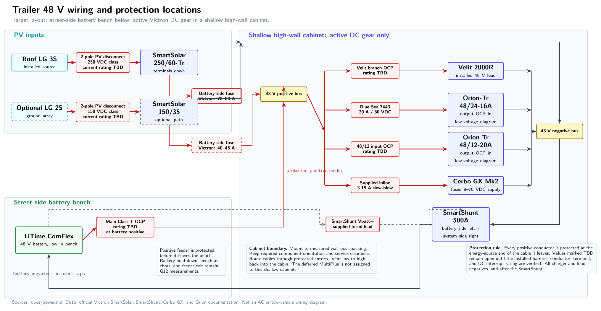
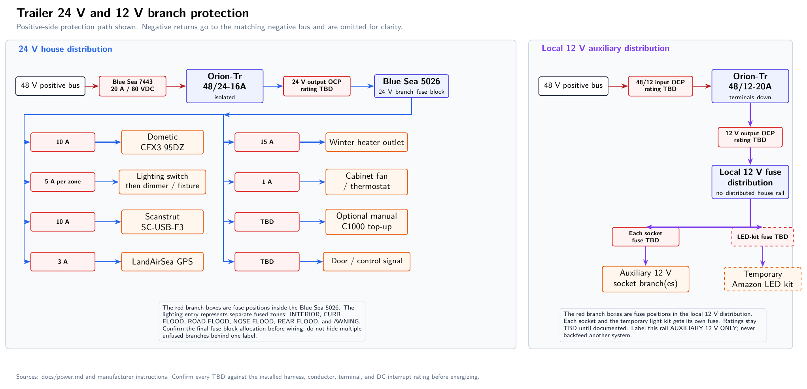
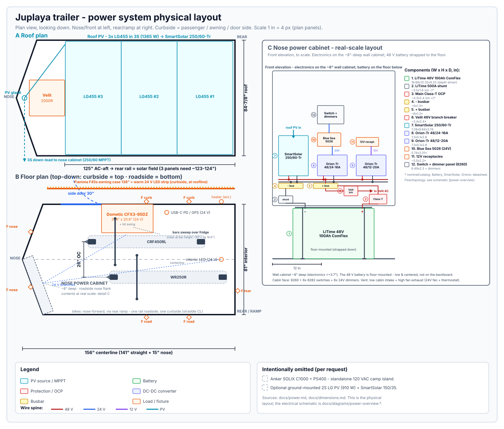

# Power / Electrical

This is the detailed power source of truth for the Juplaya trailer build. The build sheet keeps only the abbreviated view; this document carries the wiring architecture, solar topology, component decisions, commissioning rules, and energy budget.

Related decisions: [D002](DECISION_LOG.md), [D006](DECISION_LOG.md), [D008](DECISION_LOG.md), [D012](DECISION_LOG.md), and [D015](DECISION_LOG.md). D013 and D014 are retained as superseded history. Key receipts: [3-panel house-power verdict](../runs/aio-adversarial-3panel/synth/VERDICT.md), [SmartSolar 250/60 specs](reference/victron-smartsolar-mppt-250-60-tr-specs.md), [SmartSolar 150/35 specs](reference/victron-smartsolar-mppt-150-35-specs.md), [SmartShunt 500A specs](reference/victron-smartshunt-500a-specs.md), [Cerbo GX Mk2 specs](reference/victron-cerbo-gx-mk2-specs.md), [C1000/PS400 specs](reference/anker-solix-c1000-ps400-specs.md), [ComFlex battery specs](reference/litime-48v-100ah-battery-specs.md), [Orion-Tr 48/12-20A specs](reference/victron-orion-tr-48-12-20a-specs.md).

## Diagrams

**Installation authority:** follow these protection-location schematics when wiring. A label of `TBD` is an open selection, not permission to omit the device.





The older [power overview](diagrams/power-overview.png) remains useful for system context, but it is not an installation schematic and does not show every required protective device.

**Physical layout** (where the gear sits, rather than how it is wired) shows the installed roof equipment, bike stations, exterior loads, a compact battery bench in the street-side nose, and the shallow active-equipment cabinet higher on that wall. It is a placement study pending G12 measurements, not a wire-cut drawing. The standalone Anker SOLIX C1000 + PS400 AC island and the optional ground-mounted 2S LG PV are intentionally left out. Regenerate with `python3 scripts/generate_power_physical_layout_svg.py`.



Ancillary electrical/control ordering breakout: [ancillary-order-sheet.md](ancillary-order-sheet.md). Wire/cut-length/termination breakout: [wire-and-termination-order-sheet.md](wire-and-termination-order-sheet.md).

## Current Verdict

The built-in inverter/charger remains deferred. Critical trailer loads stay on DC:

- Three roof panels are mounted and charge the 48 V trailer battery through a Victron SmartSolar 250/60-Tr. The array overhangs the rear roof edge by a few inches; record the exact overhang before closing the roof-layout gate.
- The Velit 2000R runs directly from the 48 V system. Its permanent dedicated branch OCP is required and remains rating-TBD.
- One Victron Orion-Tr 48/24-16A feeds the 24 V house bus for fridge, lights, USB, GPS, and winter heater rough-in.
- One Victron Orion-Tr IP43 48/12-20A feeds fused cigarette-lighter receptacles in the power cabinet for occasional 12 V loads.
- A Victron SmartShunt 500A and Cerbo GX Mk2 are the active monitoring path. Confirm their post-trip condition and permanent mounting during the G12 dry-fit.
- Permanent protection, distribution, controls, wiring cleanup, labels, and cabinet mounting remain incomplete.
- Small 120 VAC loads run from the standalone Anker SOLIX C1000 + PS400 panel.
- The battery and battery-local Class-T main OCP live low in a compact street-side nose bench. Active Victron equipment, busbars, branch protection, controls, and low-voltage distribution live higher on the street-side wall in a shallow cabinet.
- The Victron MultiPlus-II 48/3000/35-50 120V remains the Phase 2 built-in inverter/charger choice. D015 reopened its physical location; it is not assigned to the shallow active-equipment cabinet.

## Architecture

One high-voltage battery bus, one primary conversion step to 24 V house loads, and one local auxiliary 12 V converter for cabinet receptacles:

```text
Optional LG ground PV (2S)
        |
   2-pole 150 V-class PV disconnect/OCP, current rating TBD
        |
   SmartSolar 150/35
        |
   40-45 A battery-side fuse
        +-- 48 V positive bus

Roof PV (3 x LG455 in 3S)
        |
   2-pole 250 V-class PV disconnect/OCP, current rating TBD
        |
   SmartSolar 250/60-Tr
        |
   70-80 A battery-side fuse
        +-- 48 V positive bus

Street-side battery bench:
   battery positive -> Class-T main OCP, rating TBD -> protected feeder -> cabinet positive bus
   battery negative -> dedicated feeder -> SmartShunt battery side

Shallow high wall cabinet:
   SmartShunt system side -> cabinet negative bus -> every load and charger negative
   positive bus -> Velit branch OCP, rating TBD -> Velit 2000R
   positive bus -> Blue Sea 7443, 20 A / 80 V DC -> Orion-Tr 48/24 -> output OCP TBD -> Blue Sea 5026
   positive bus -> Orion 48/12 input OCP TBD -> Orion-Tr 48/12 -> output OCP TBD -> local 12 V fuse block
   positive bus -> supplied 3.15 A slow-blow fuse -> Cerbo GX Mk2
   battery positive -> SmartShunt supplied fused Vbatt+ sense lead

Victron Cerbo GX Mk2:
   VE.Direct -> SmartShunt 500A, SmartSolar 250/60-Tr, SmartSolar 150/35
   VE.Bus    -> future MultiPlus-II
   VE.Can    -> reserved for future Victron-compatible CAN gear

Anker SOLIX C1000 + PS400 400 W panel -> standalone 120 VAC loads

Phase 2 optional:
LiTime 48 V battery -> location-TBD Victron MultiPlus-II 48/3000/35-50 120V -> built-in 120 VAC / shore charging / transfer
```

Why 48 V: the Velit air conditioner is 48 V-native, and at 48 V the cables stay small. Why 24 V house loads: the fridge auto-senses 12/24 V, Yuji LED strips are 24 V, the Scanstrut USB-C takes 24 V input, and the selected exterior lights are 12-28 VDC wide-input fixtures. The 12 V converter is scoped narrowly: a switched, fused accessory outlet bank in the power cabinet for occasional 12 V devices, not a distributed house rail.

## Solar Topology

**Panels on hand:** 5 x LG455N2W-E6. Three are mounted on the roof. They did not fit entirely behind the Velit reserve, so the installed array extends a few inches beyond the rear roof edge; exact overhang remains unmeasured. Two panels can travel inside and deploy on the ground.

| Source | String | Power | Controller | Status |
|---|---:|---:|---|---|
| Deployable LG ground pair | 2S | 910 W | Victron SmartSolar MPPT 150/35 | ordered, optional use |
| Roof LG panels | 3S | 1365 W | Victron SmartSolar MPPT 250/60-Tr | installed; rear overhang exact dimension TBD |
| Anker PS400 | 1 panel | 400 W | Anker SOLIX C1000 input | separate AC island |

Rules:

- Roof 3S lands only on the SmartSolar 250/60-Tr.
- Never put roof 3S into a 145/150 V-class AIO or MPPT.
- Never combine roof 3S and ground 2S on one tracker.
- The PS400 feeds the C1000 only. Do not series or parallel it with LG panels.
- Physically label and segregate roof PV, LG ground PV, and Anker PV connectors so mis-plugging is not plausible.

## Roof Solar Mounting

Physical mount sources: [solar mounting build sheet](solar_mounting.md) and [solar panel mounting/backing research](research/solar-panel-mounting-backing-2026-06-06.md).

Mechanical verdict: the existing panel brackets attach the modules to a rail system; they do not define the trailer load path. Use two fore-aft NXT rails spanning the roof array field, drilled through at bow crossings and tied to multiple roof bows with backing/crush control. Use 1/4 in aluminum spacer pads only where needed for low-profile drainage/crown control. Add a third rail only if dry-fit stiffness or bracket geometry requires it. Do not fasten the roof modules to roof skin alone.

Before foam or Henry 887 roof coating, inspect the installed rails, panel clamps, PV gland, and roof wiring; measure the rear overhang; remove the Velit for opening reinforcement and crown/drainage dry-fit; then reseal and hose-test every disturbed penetration. Keep roof 3S wiring clipped to the rails, with service loops and labels so it cannot be confused with the optional ground 2S input.

Voltage checks:

- LG455 Voc is 49.9 V. Roof 3S is 149.7 V at STC and roughly 163-171 V cold signal, so it needs a 250 V-class controller.
- LG ground 2S is 99.8 V at STC and roughly 109-114 V cold signal, so the SmartSolar 150/35 is appropriate.
- The PS400 is 57.6 V Voc, intentionally close to the C1000's 60 V input ceiling. Use it as the matched Anker single-panel input.

## 48 V Stack

| Component | Role | Notes |
|---|---|---|
| LiTime 48 V 100 Ah Smart ComFlex | house battery | 5.12 kWh, 100 A continuous charge/discharge, Bluetooth BMS |
| Victron SmartShunt 500A | instrumentation | high cabinet; battery negative alone on battery side; every load and charger negative on system side; supplied fused Vbatt+ sense lead |
| Victron Cerbo GX Mk2 | monitoring / control | high cabinet; supplied 3.15 A slow-blow inline supply fuse; VE.Direct to SmartShunt and SmartSolars now, VE.Bus to MultiPlus later |
| Main battery OCP | protection | Class-T at battery positive inside low bench, before the positive feeder leaves; rating TBD |
| SmartSolar 250/60-Tr | roof MPPT | roof 3S only; 70-80 A battery-side fuse before positive bus |
| SmartSolar 150/35 | ground MPPT | optional LG ground 2S only; 40-45 A battery-side fuse before positive bus; connector variant pending |
| Velit 2000R | 48 V DC load | dedicated branch OCP required; rating TBD pending manufacturer documentation |
| Orion-Tr 48/24-16A | house converter | Blue Sea 7443 20 A / 80 V DC input breaker; output OCP TBD; remote on/off to cabin toggle |
| Orion-Tr IP43 48/12-20A | auxiliary 12 V converter | input and output OCP ratings TBD; remote off; feeds only cabinet receptacles |

D015 splits the enclosure. The low street-side nose bench contains only the secured battery, battery-local Class-T main OCP, and protected feeder departure. The shallow cabinet higher on the street-side wall contains the SmartShunt, both SmartSolars, Cerbo, both Orions, positive and negative busbars, branch protection, the Blue Sea 5026, local 12 V distribution, and controls. G12 must close component fit, backing, service clearance, feeder routing, and ventilation before fabrication or final wire cuts.

The battery negative feeder terminates first at the SmartShunt battery-side stud in the high cabinet. Nothing else may land on the battery side. The SmartShunt system-side stud feeds the cabinet negative bus, and every load and charger negative returns there.

The LiTime 500 A Bluetooth shunt is superseded for the active build and kept only as spare/test gear.

## Victron Monitoring / Networking

The installed monitoring path is now Victron-native from the start:

```text
SmartShunt 500A       --VE.Direct--> Cerbo GX Mk2
SmartSolar 250/60-Tr  --VE.Direct--> Cerbo GX Mk2
SmartSolar 150/35     --VE.Direct--> Cerbo GX Mk2
Future MultiPlus-II   --VE.Bus-----> Cerbo GX Mk2
```

The Cerbo gives local/VRM visibility into battery SOC, charge/discharge current, solar harvest, alarms, and the future MultiPlus state. It does **not** make the LiTime ComFlex a managed Victron battery, and the current Orion-Tr converters remain remote-on/off power supplies rather than networked telemetry devices.

Reserve VE.Can for future Victron-compatible CAN gear. If the build later moves to Lynx, the compatible LiTime path is Lynx Shunt VE.Can / Lynx Distributor as distribution and monitoring gear; do not spec Lynx Smart BMS unless the battery bank changes to Victron Lithium Smart.

## Split Power Enclosure Ventilation

Active plan: **vent the shallow high cabinet to the cabin and avoid exterior penetrations.** The cabinet gets a filtered low intake from the cabin and a high fan-assisted exhaust back to the cabin. Keep the battery bench separate, dry, restrained, and serviceable. This arrangement keeps tow rain and playa dust away from active electronics and avoids another wall hole in the nose.

The open trailer inlet and outlet admitted substantial playa dust during the 2026-07 field use. Before the next playa trip, fit positive-closing caps, plugs, or shutters to every unused exterior opening and add their travel-state check to the departure checklist. Do not rely on loose filter media as a closure.

Deferred fallback: if cabin-side ventilation cannot keep cabinet temperature under control during shakedown, reopen an exterior-vent path. The preferred exterior fitting remains the **[RecPro RP-2414 Exterior Wall Vent for Enclosed Trailers with 3" Hole](https://recpro.com/exterior-wall-vent-for-enclosed-trailers-with-3-hole/)**, color to match the trailer exterior. It is a low-profile 2-piece enclosed-trailer side vent over a 3" sidewall hole, with a UV-resistant polypropylene exterior cowl, interior round grille, weep path, and front-driver-side / rear-curb-side ram-air orientation guidance. Hardware and sealant are not included.

**Exterior-placement constraint:** do not use an unprotected, forward-facing high nose location as the normal vent path. The RecPro fitting is a sidewall vent with front-driver-side / rear-curb-side orientation guidance; a high nose vent sees ram wind, rain, and playa dust while towing and can become a forced intake when the fan is off. If a high nose location is unavoidable, treat it as a closable travel vent: interior shutter or backdraft damper, cowl/louver opening rearward or downward, drainage/weep path kept clear, and hose-test before the wall closes.

Recommended cabinet airflow:

- **Low intake:** filtered interior transfer vent in the lower portion of the shallow cabinet face, pulling relatively clean cabin air.
- **High exhaust:** fan-assisted interior transfer vent near the upper cabinet face, exhausting back to the cabin. Keep intake and exhaust separated enough that the fan does not short-cycle hot air.
- **Fan:** 24 V, 120 mm, dust-resistant fan on the 24 V house bus; fuse at 1 A. A Noctua NF-F12 industrialPPC-24V-2000 SP IP67 PWM-class fan is enough airflow and survives dust better than a bare PC fan.
- **Control:** normally-open enclosure thermostat closing on temperature rise, set around 95 F on / 85 F off. Add a manual override if convenient.
- **Test:** with roof solar charging and both Orions enabled, verify cabinet air stays below 40 C / 104 F near the SmartSolars and Orions. Victron MPPTs are full-rated to 40 C and derate above that.

If cabin-side ventilation fails the shakedown temperature test, change course: add an exterior vent path using the RecPro sidewall fitting, with the exterior-placement constraint above.

## 24 V House Bus

One Victron Orion-Tr 48/24-16A isolated converter feeds a Blue Sea 5026 fuse block. Wire the Orion remote on/off to a cabin toggle so the house bus can be killed without opening the cabinet.

Approximate current is for planning and load-shedding. Fuses still size to the protected wire/device branch, not to these rough draw numbers.

| Branch | Approx current | Fuse | Wire | Notes |
|---|---:|---:|---|---|
| Fridge, Dometic CFX3 95DZ | ~4.6 A running | 10 A | 14 AWG | 24 V native; verify less than 3 percent round-trip voltage drop |
| LED lighting zones | ~4-10 A exterior depending on fixtures; ~2-3 A interior typical | 5 A per zone | TBD | 24 V interior strips plus exterior zones below |
| Scanstrut SC-USB-F3 | up to ~5 A at full USB-C load | 10 A | TBD | manufacturer-recommended branch fuse; 24 V in to USB-C PD |
| LandAirSea Overdrive Permanent GPS | <0.1 A typical | 3 A | TBD | ordered; hardwired always-on security |
| Door switch | signal only | TBD | TBD | dry contact |
| Winter heater outlet | ~1-2 A run; glow up to ~11 A | 15 A | 12 AWG | exterior reachable; N4 glow may exceed current July converter margin |
| Optional C1000 top-up | up to 10 A, about 240 W | TBD | TBD | manual/fused branch only; disable before it starves critical 24 V loads |

Sizing honesty: current July loads fit the 16 A Orion. Winter use requires glow-window load shedding or a separate decision on additional converter capacity after G12.

## Lighting And Switches

Switching plan: **put the lighting switches on the shallow high cabinet face**, not beside the entry door. This keeps wiring serviceable. While the walls are open, leave a labeled pull string or spare low-current pair to the side-door bay only if it is easy; a future entry switch can be added later if real use proves it is worth the wire.

Switch hardware: use a **Blue Sea 8260 6-position Contura mounting panel** with **Blue Sea 8282 Contura III SPST OFF-ON black switches**. The 8282 is rated 15 A at 24 V DC, so it has ample margin for these fused lighting branches. The 8260 panel accepts 0.06" to 0.38" mounting thickness; if the power-cabinet face is 1/2" ply, mount the switches in a thin ABS/aluminum inset plate or back-rabbet the cutout. Wire each switch downstream of its Blue Sea 5026 branch fuse as a hard enable, then put a panel-mount 24 V dimmer control downstream of the switch for brightness control.

Recommended switch labels:

| Position | Label | Function |
|---:|---|---|
| 1 | INTERIOR | hard enable for interior dimmer/main-task lighting |
| 2 | CURB FLOOD | hard enable for dimmer/two curbside `VAL2-NW9` fixtures |
| 3 | ROAD FLOOD | hard enable for dimmer/two roadside `VAL2-NW9` fixtures |
| 4 | NOSE FLOOD | hard enable for dimmer/both V-nose `VAL2-NW9` fixtures |
| 5 | REAR FLOOD | hard enable for dimmer/rear `VAL2-NW9` loading-work light |
| 6 | AWNING | hard enable for the awning dimmer/strip |

Use custom printed labels for those names; the Blue Sea 8214 label set is useful for generic DC labels but may not include the exact flood-zone names. Preferred finished control is a panel-mount 24 V dimmer, one after each lighting switch: INTERIOR, CURB FLOOD, ROAD FLOOD, NOSE FLOOD, REAR FLOOD, and AWNING. Exact SKU waits for the cabinet-panel mockup and bench test. Blue Sea 7509 DeckHand is the robust marine reference at 24 V / 12 A and includes a momentary panel switch, but it is much more expensive and is specified for non-regulated LEDs. Cheap PWM knob dimmers such as the `LDK-8A` remain acceptable bench-test/prototype parts, not the finished-cabinet default.

Bench-test the ordered `VAL2-NW9` flood/scene fixture with the selected panel dimmer before final exterior mounting. The product specs confirm 12-28 VDC input, 18 W, and 1.5 A current draw, but do not explicitly claim dimmer compatibility. If the fixture flickers, buzzes, shuts down, or runs hot on the selected dimmer, keep the cabinet switch and either run that side switch-only or change to a dimmable exterior fixture.

Use **24 V-native or 10-30 V DC exterior-rated LED fixtures**. The current selected fixture class is 12-28 VDC, so the lights run directly from the 24 V house bus. Do not build a 12 V exterior-lighting sub-bus for this plan, and do not run lighting through cigarette-lighter receptacles. House exterior lights stay completely separate from the OEM trailer lighting and the 7-way plug.

Active exterior layout: **2 curbside floods, 2 roadside floods, 1 flood on each V-nose face, 1 rear flood, plus separate awning lighting**. Count is seven flood fixtures plus the awning light circuit.

Panel verdict: **7 x Super Bright LEDs `VAL2-NW9` flood/scene fixtures are ordered**. It is the same 9" black 1450 lm / 18 W / 90 deg / IP67 / 12-28 VDC fixture class as `VAL2-WW9`, but 4000 K is more useful for work/security floods than 3000 K. `VAL2-WW9` remains the warm-white alternate if replacement stock is ever needed. For the awning, use a separate warm 24 V dimmable strip such as **Super Bright LEDs `RA-IP68-80CRI-5m`, 3000 K** under the case/rail rather than another glare flood.

| Zone | Fixture count | Approx current | Fuse | Wire | Notes |
|---|---:|---:|---|---|
| Interior main/task | TBD | ~2-3 A @ 24 V typical | 5 A | TBD | Yuji strips in aluminum channel; cabinet switch plus panel dimmer |
| Awning/camp light | 1 x 5 m strip max | 64 W max / ~2.7 A @ 24 V before dimming | 5 A | 16-18 AWG | `RA-IP68-80CRI-5m` 3000 K or equivalent; cabinet switch plus panel dimmer; diffuse/downward, not a glare bar |
| Curbside floods | 2 x `VAL2-NW9` | 36 W / ~1.5 A @ 24 V | 5 A | 16 AWG | down/out aimed for camp/work; cabinet switch plus panel dimmer, pending bench test |
| Roadside floods | 2 x `VAL2-NW9` | 36 W / ~1.5 A @ 24 V | 5 A | 16 AWG | down/out aimed for roadside work; cabinet switch plus panel dimmer, pending bench test |
| Nose floods | 2 x `VAL2-NW9` | 36 W / ~1.5 A @ 24 V | 5 A | 16 AWG | one fixture on each V-nose face; cabinet switch plus panel dimmer, pending bench test |
| Rear flood | 1 x `VAL2-NW9` | 18 W / ~0.75 A @ 24 V | 5 A | 16 AWG | upper rear/down-aimed loading light; cabinet switch plus panel dimmer, pending bench test; not tied to reverse/tow wiring |
| Optional step/courtesy | 1-2 small amber fixtures | <0.5 A | 3 A or shared 5 A branch | 18 AWG | optional low amber at personnel door/step; can share awning switch |
| Spare exterior/service | TBD | TBD | 5 A | 16-18 AWG | capped spare pair if the wall path is open |

Seven `VAL2-NW9` floods total **126 W / ~5.25 A @ 24 V**. Full awning strip adds **64 W / ~2.7 A @ 24 V** before dimming. That is fine as short-duration lighting, but do not combine all exterior lights with full USB-C load, optional C1000 top-up, and winter heater glow.

Voltage guardrail: because the selected flood fixtures are rated **12-28 VDC**, set and verify the Orion 48/24 output stays below 28 V under all charge/load states. Target normal 24 V output, not a 28+ V "24 V battery charge" profile.

Similar-spec panel considered `VAL2-WW9`, `VAL2-NW9`, the 13"/17"/22" Super Bright LEDs area lights, Optronics `UCL41CB`, TecNiq `P06`, Buyers `1492135`, Abrams Cobalt XS, Handxen 9" 20 W, STEDI/NAPA Mini LED Flood, Hella SM2000, Grote Trilliant, Scandvik E-500, ECCO EW2411, Primelux PX0415, and Home Depot low-voltage deck options. Verdict: `VAL2-NW9` wins the flood positions on 24 V compatibility, output, warm-enough work light, low profile, IP67 rating, and cost. Optronics `UCL41CB` is the best trailer-native fallback; TecNiq `P06` is the rugged premium fallback; Buyers/Abrams are budget fallbacks only if cool or unspecified CCT is acceptable. Oversized 13"/17"/22" fixtures waste too much power for seven positions. See [exterior-lighting panel verdict](../runs/exterior-lighting-panel/synth/VERDICT.md).

Load-shed rule: do not run every flood, full awning strip, full USB-C load, optional C1000 top-up, and winter heater glow at the same time on the 16 A 24 V converter. For Juplaya, all floods are short-duration work/security loads; normal camp mode should be awning/interior lighting only.

## Auxiliary 12 V Cabinet Receptacles

The Victron Orion-Tr IP43 48/12-20A isolated converter feeds a local fuse block and a small set of cigarette-lighter receptacles in the shallow high cabinet. This is for occasional 12 V loads and adapters, not for the fridge, permanent lighting, USB-C PD, GPS, tow-vehicle wiring, or OEM trailer lights. The temporary Amazon LED kit used during the 2026-07 field trip may remain only on its own labeled fuse until the permanent lighting is installed.

| Item | Limit | Protection | Notes |
|---|---:|---|---|
| Orion-Tr IP43 48/12-20A | 20 A / 240 W at 12 V | DC-rated 48 V input OCP, rating TBD; output OCP, rating TBD | 32-70 V input, 12.2 V nominal output, remote off when unused |
| Cigarette-lighter receptacles | per receptacle rating, total below 20 A | fuse each receptacle branch; ratings TBD | install in shallow cabinet; label auxiliary 12 V only |
| Temporary Amazon LED kit | temporary only | dedicated branch fuse, rating TBD | label and remove when permanent lighting is commissioned |

The converter's no-load input current is under 80 mA, roughly under 4 W on the 48 V bus. That is small, but still worth switching off by remote when the receptacles are not in use. IP43 protection only applies with the screw terminals facing down.

## C1000 AC Island

The Anker SOLIX C1000 + PS400 panel is portable camp gear, not trailer AC distribution.

Use it for:

- laptops, phones, radios, camera/tool battery chargers
- Starlink Mini-class loads, if needed
- brief small-appliance hits

Do not use it for:

- sustained electric cooking
- electric space heating
- backfeeding trailer AC wiring

Optional 24 V trailer top-up:

- A fused/manual 24 V bus feed into the C1000 XT-60 input is acceptable as a discretionary auxiliary charge path.
- The C1000 accepts 11-32 V at 10 A, so call this about 240 W maximum.
- Enable it only when the trailer battery is healthy and the Orion has spare capacity.
- Keep this top-up on the 24 V bus if used; the 12 V cabinet receptacles would cut the charge rate roughly in half and burn an extra conversion stage.
- Do not direct-feed the C1000 from the 48 V battery unless a dedicated current-limited DC-DC charger is designed later.

### Starlink Mini Storage / Camp Option

Treat Starlink Mini as optional storage/camp comms, not the primary tracker. Current [Starlink Mini specs](https://www.starlink.com/public-files/specification_sheet_mini.pdf) list **25-40 W average**, **12-48 V / 60 W max input**, and a **100 W, 20 V / 5 A minimum** requirement when using the Starlink USB-C-to-barrel accessory. That is about **1.0-1.7 A average at 24 V** or **2.5 A max at 24 V** before converter/cable losses. Continuous 24-hour use is **0.6-1.0 kWh/day** before losses; budget **0.7-1.1 kWh/day** in the real trailer.

Preferred Juplaya path:

- Keep it portable and run it from the C1000/PS400 first, so internet does not become a house-battery design dependency.
- A DC option is acceptable later: Starlink's [Mini Car Adapter](https://www.starlink.com/public-files/accessories_guide_mini.pdf) is intended for standard 12-24 V auxiliary outlets, so it can use a fused 12 V cabinet receptacle if cable length and voltage drop behave.
- Do not permanently mount it or count on always-on internet until a shakedown proves the roof solar/house battery still has surplus after AC and fridge duty.

Oakland storage use:

- LandAirSea/cellular remains the primary always-on "where is the trailer?" path because it is low power and hidden.
- Starlink Mini is the secondary high-bandwidth contact path for camera/telemetry/remote check-ins, but only if the storage spot has open sky. It will not work reliably inside a metal trailer or under covered storage.
- If left on 24/7, the 48 V 100 Ah house battery class is only a several-day buffer without solar. For storage, either leave roof solar live with a conservative low-voltage cutoff, or power Starlink on a schedule rather than treating it as an always-on background load.
- A roof-mounted Mini needs a theft-resistant, serviceable mount and cable gland; a visible dish is itself a target in storage.
- Storage-site decision: a free Oakland spot with poor sky is still acceptable if physical security and cellular signal are good. In that case, leave Starlink portable/offline and use cellular telemetry.
- Pay or detour for an Alameda/open-sky spot only if it improves physical security, access, solar exposure, or enables broadband telemetry enough to justify the monthly delta.
- If battery voltage, door state, temperature, or humidity telemetry is needed without open sky, add a low-power cellular IoT node rather than keeping Starlink awake. If images are needed, use a cellular battery/solar camera only after confirming LTE signal at the actual parked trailer.

## Phase 2 MultiPlus

The Victron MultiPlus-II 48/3000/35-50 120V remains the later integrated inverter/charger recommendation if the trailer needs built-in 120 VAC distribution, shore/generator charging, or automatic transfer.

Deferred because Juplaya does not need it:

- Critical loads are DC.
- The C1000 handles small 120 VAC loads.
- Skipping the built-in inverter removes idle draw, cabinet time, AC wiring, and commissioning risk.

If installed later, treat 2400 W at 25 C / 2200 W at 40 C as the sustained AC design envelope, and cap combined charge current at or below the ComFlex battery's 100 A continuous charge limit.

D014's upper-cabinet location is superseded by D015. The MultiPlus is not part of the shallow active-equipment cabinet. Its future location remains open and must separately resolve structural support, service access, ventilation, the protected DC path, VE.Bus routing to the Cerbo, and shore/generator AC routing.

## Protection And Commissioning

Before energizing:

- Battery side first on MPPTs, then PV.
- Verify roof 3S lands only on the SmartSolar 250/60-Tr.
- Verify optional LG ground 2S lands only on the SmartSolar 150/35.
- Verify PS400 lands only on the C1000.
- Use a 2-pole, 250 V-class PV disconnect/OCP for roof PV and a separate 2-pole, 150 V-class unit for optional ground PV. Both current ratings remain TBD.
- Install the SmartSolar 250/60-Tr battery-side fuse in its positive lead before the 48 V positive bus; Victron specifies 70-80 A.
- Install the SmartSolar 150/35 battery-side fuse in its positive lead before the 48 V positive bus; Victron specifies 40-45 A.
- Install the Class-T main OCP at battery positive inside the low bench, before the positive feeder leaves. Its rating remains TBD; do not substitute 32 V automotive fuse gear on the 48 V side.
- Install the SmartShunt in the battery-negative path before the negative bus, with the load/charger side feeding every trailer load and charger negative.
- Install the SmartShunt's supplied fused Vbatt+ sense lead at battery positive as shown in the manufacturer instructions.
- Run VE.Direct from SmartShunt and both SmartSolars to the Cerbo GX Mk2; add VE.Direct-to-USB only if the three built-in ports are not enough after layout.
- Power the Cerbo through its supplied 3.15 A slow-blow inline fuse; configure VRM/WiFi and the required alarms.
- Use Blue Sea 7443 for the 20 A / 80 V DC UL-489 breaker. Do not use Blue Sea 7463 for this DC branch; it is a 2-pole 240 V AC breaker.
- Use the Blue Sea 7443 on the Orion 48/24 input. Keep the Orion 48/24 output OCP, Orion 48/12 input and output OCPs, and each 12 V receptacle fuse explicitly TBD until their selections are documented. Orient the 48/12 Orion screw terminals down if relying on IP43.
- Label the 12 V cabinet receptacles as auxiliary only; do not backfeed tow-vehicle 12 V, OEM trailer lighting, the 24 V bus, or C1000 charging through them.
- Configure LiFePO4 charge profiles: absorption 57.6 V, float about 55.2 V, equalization off, temperature compensation off.
- Cap combined trailer charge current at or below 100 A.
- Test the optional C1000 24 V top-up branch under fridge/lighting load before relying on it.

## 2026-07 Field Observations

- The Velit was installed and operated from the 48 V system.
- The MPPT and both DC-DC converters were set up. The Dometic ran from 24 V, and the temporary Amazon LED kit ran from 12 V.
- With no insulation or finished walls, the Velit did not bring the trailer to its 68 F setpoint in 100 F playa ambient. The trailer slowly approached about 85 F only after ambient temperature fell below that.
- Peak observed consumption was about 600 W. Peak solar generation was not captured, so this trip does not close the energy-production gate.
- The three roof panels were installed with an aft overhang of a few inches.
- The Velit opening touches a roof crossbeam at its forward edge but lacks equivalent support at the aft edge. Tightening the unit formed a roof valley. Remove the unit, add the planned longitudinal 1 in steel reinforcement between crossbeams, and dry-fit crown-forming rubber spacers before resealing.
- No insulation or wall finish was installed. The open inlet and outlet admitted heavy playa dust; clean the trailer before enclosure work and provide positive travel closures.

## Energy Budget

| Load | kWh/day |
|---|---:|
| Fridge, CFX3 95DZ desert duty | 1.0-1.3 |
| 24 V bus / controls overhead | 0.1-0.3 |
| Velit AC realistic duty | ~2.4 |
| **Trailer DC total** | **about 3.5-4.0** |

Roof-only 3S solar makes roughly 6.0 kWh/day before soiling/shading, enough for nominal July DC loads. The expected fridge + realistic Velit + small-DC load is about 3.8 kWh/day, leaving about 2.2 kWh/day clean-sun margin and staying positive through roughly a 25-33% solar derate. Detail: [roof-only 3S fridge + AC math](research/roof-3s-fridge-ac-energy-math-2026-06-05.md).

The optional 2S LG ground pair adds trailer-battery margin for AC-heavy days, dust, Velit shadow, or deficit recovery. The C1000 and PS400 form a separate small-AC budget.

## Open Gates

- Roof repair and drawing: measure the panel overhang and Velit opening, add longitudinal steel reinforcement around the unsupported opening, dry-fit the crown/drainage spacers, and update panel/rail/gland stations.
- G12 split enclosure: measure and dry-fit the street-side battery bench and shallow high cabinet, confirm backing/service clearances, establish the protected feeder route, and choose a separate future MultiPlus location.
- Battery-terminal main OCP selection.
- Ground MPPT connector variant and portable inlet/disconnect details.
- 12 V cabinet receptacle count, fuse sizes, wire gauge, and remote switch location.
- Exterior lighting final branch wire gauges and penetration/seal details.
- Optional C1000 24 V top-up branch test.
- Real shakedown energy use before leaving the generator home.
