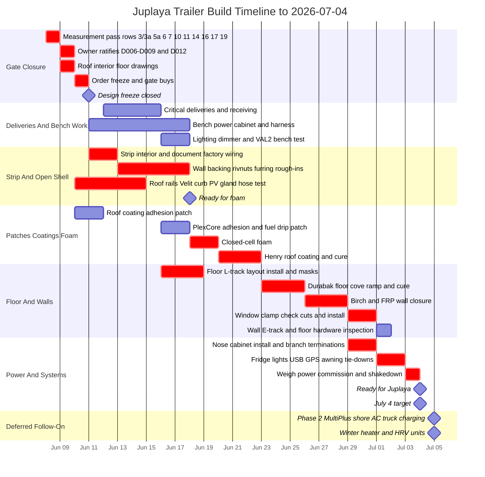

# Juplaya Trailer Build Timeline

Updated: 2026-06-08

Target readiness milestone: 2026-07-04.

This is a first-pass dependency timeline for the Juplaya build. The source of truth remains the build sheet and supporting docs:

- [juplaya-trailer-context.md](juplaya-trailer-context.md), especially "Build sequence (dependency order)" and "Design freeze - definition of done"
- [dimensions.md](dimensions.md), especially the measurement pass table
- [DECISION_LOG.md](DECISION_LOG.md), especially D006-D012 status
- [order-sheet.md](order-sheet.md), especially ordered, remaining, and "BUY AFTER GATE" rows
- [power.md](power.md), especially protection and commissioning gates
- [solar_mounting.md](solar_mounting.md), especially roof rail install sequence and open measurements

## Assumptions

- Calendar starts on 2026-06-08 and targets readiness on 2026-07-04.
- Durations assume an aggressive shop cadence with several full build days, not casual evening-only work.
- The measurement, drawing, ratification, and order-freeze sprint is intentionally compressed into 2026-06-08 through 2026-06-11. If that gate takes longer, the July 4 target is immediately at risk.
- Proposed decisions D006-D009 and D012 remain gates until owner ratification. D010 and D011 are treated as accepted.
- Durabak delivery is modeled as the 2026-06-12 to 2026-06-15 window already recorded in the order sheet.
- "Ready" means weighed, commissioned, and shakedown-tested enough for Juplaya. Phase 2 inverter/shore power, winter heat unit install, HRV unit install, and truck charging hardware stay deferred.

## Gantt

## Critical Path

The critical path is measurement and ratification, then roof/open-wall work, foam, roof coating, floor coating, wall closure, windows, cabinet/systems install, and commissioning. In this schedule there is effectively no slack. Design freeze needs to close by 2026-06-11; a slip in the measurement/design freeze gate or the open-wall/bare-roof window likely lands directly on the July 4 readiness date.

The key early gate is design freeze. It closes when the build sheet's ten design-freeze rows close, with special attention to:

- Measurement pass rows for roof drawing, wall/window bays, floor steel and bike geometry, rail scan/post wall thickness, OSB thickness, fridge bay, and curb/tongue weight.
- Owner ratification of D006-D009 and D012 where still proposed.
- "BUY AFTER GATE" roof solar rails/backing, windows, wall/FRP, fridge bay, dimmers, and related hardware.

## Parallel Work

The only meaningful parallelism before July 4 is bench work and procurement while the shell work is happening:

- Prebuild the nose power cabinet, harnesses, switch panel, labels, and branch protection on the bench.
- Bench-test one ordered exterior flood with the selected dimmer before committing to all finished dimmers.
- Buy unblocked power, coating prep, lighting, security, cabinet ventilation, labeling, and general consumables immediately.
- Keep Phase 2 MultiPlus, shore AC distribution, winter heater unit, HRV unit, exterior vent fallback, truck charging hardware, and Starlink as deferred follow-ons.

## Commissioning Gate

The final commissioning pass must verify:

- Roof 3S PV lands only on the SmartSolar 250/60-Tr.
- Optional LG ground 2S lands only on its own SmartSolar 150/35 path.
- PS400 remains isolated to the C1000.
- Battery-side MPPT sequence, DC-rated OCP, battery-terminal main OCP, Orion input/output protection, and 48/12 receptacle labeling are correct.
- LiFePO4 settings are configured and combined trailer charge current is capped at or below 100 A.
- Optional C1000 24 V top-up, if installed, does not starve the Orion/fridge bus.
- Fridge bay has 50 mm clearance, forced through-flow, correct lid orientation, and acceptable in-bay temperature.
- Cabinet ventilation holds temperature under shakedown load.
- Final curb weight and tongue weight are measured.
